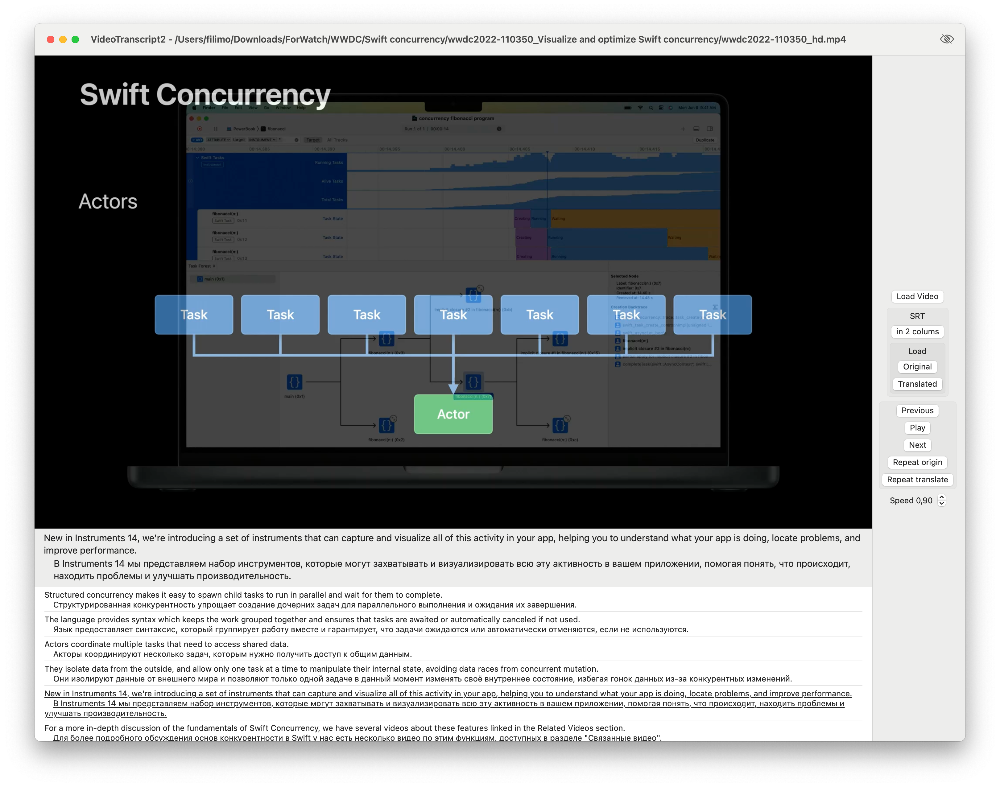

## VideoTranscript2 Application Features

### Overview

VideoTranscript2 is an advanced multimedia application that enhances the experience of viewing and listening to audio and video content by offering dual subtitle support. This tool is particularly useful for bilingual studies, translation comparisons, and improved media navigation.

### Main Features

1. **Dual Subtitles**: 
   - Users can load two sets of subtitles simultaneously, facilitating language learning and translation comparisons.
   - The interface supports displaying original and translated subtitles side by side.

2. **Convenient Navigation**:
   - Allows easy navigation through the media by subtitle fragments.
   - Users can quickly jump to previous or next subtitle segments.

3. **Highlighted Text**:
   - The currently active subtitle fragment is underlined, helping users identify the current point of focus effortlessly.

4. **Key Controls**: Control the playback and navigation with simple keyboard shortcuts:
  - **A**: Jump to the previous subtitle fragment.
  - **S**: Toggle between play and pause states.
  - **D**: Jump to the next subtitle fragment.
  - **E**: Repeat the current original subtitle fragment.
  - **R**: Repeat the translated subtitle fragment.
   
5. **Persistent State**:
   - The application saves the state of chosen subtitles and media files, restoring them upon relaunch for continuous usage without losing progress.

6. **Playback Speed Control**:
   - Users can adjust the playback speed through a speed slider, allowing them to slow down or speed up the media as needed.

7. **Real-Time Audio Generation**:
   - Integrated with the OpenAI API, the app supports real-time audio generation using speech synthesis models, enhancing the multimedia experience with synchronized narration.

### Version 1.1 Updates

- **Real-Time Audio Generation**: Now includes real-time audio generation capabilities with caching for smoother performance with OpenAI API.
- **Swift 6 Migration**: Upgraded to Swift 6, offering improved performance and access to the latest language features.
- **Full Support for Swift Concurrency**: Enhanced concurrency support for better handling of asynchronous tasks.

### Usage

- Load your media file and the corresponding subtitle files.
- Use subtitle fragments as reference points to navigate through the content efficiently.
- Utilize keyboard shortcuts for playback control and navigation.

### Conclusion

VideoTranscript2 is an ideal tool for those looking to enhance their multimedia experience, whether for language learning, translation studies, or efficient media navigation. Enjoy a versatile and user-friendly interface designed to meet diverse multimedia needs.
